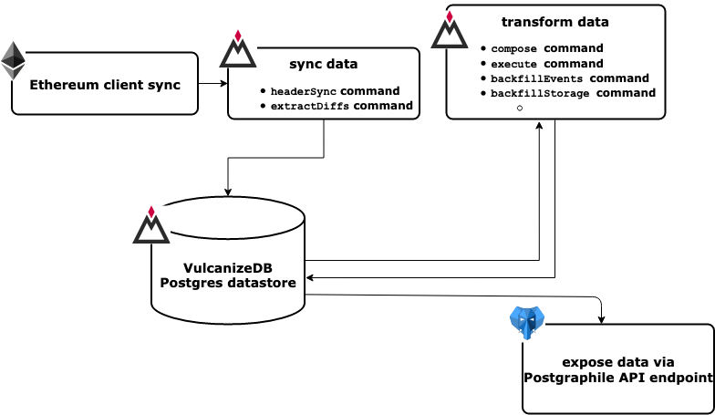

# Vulcanize DB

> Vulcanize DB is a set of tools that make it easier for developers to write application-specific indexes and caches for dapps built on Ethereum.

## Table of Contents
1. [Background](#background)
1. [Install](#install)
1. [Usage](#usage)
1. [Contributing](#contributing)
1. [License](#license)

## Background
The same data structures and encodings that make Ethereum an effective and trust-less distributed virtual machine complicate data accessibility and usability for dApp developers. VulcanizeDB improves Ethereum data accessibility by providing a suite of tools to ease the extraction and transformation of data into a more useful state, including allowing for exposing aggregate data from a suite of smart contracts.

VulcanizeDB includes processes that extract and transform data.
Extracting involves querying an Ethereum node and persisting returned data into a Postgres database.
Transforming takes that raw data and converts it into domain objects representing data from configured contract accounts.

## Install

1. [Dependencies](#dependencies)
1. [Building the project](#building-the-project)
1. [Setting up the database](#setting-up-the-database)
1. [Configuring a synced Ethereum node](#configuring-a-synced-ethereum-node)

### Dependencies
 - Go 1.12+
 - Postgres 11.2
 - Ethereum Node
   - Vulcanize currently requires a forked version of [Go Ethereum](https://github.com/makerdao/go-ethereum/) (1.8.23+) in order to store storage diffs.
   - [Parity 1.8.11+](https://github.com/paritytech/parity/releases)

### Building the project
Download the codebase to your local `GOPATH` via:

`go get github.com/makerdao/vulcanizedb`

Move to the project directory:

`cd $GOPATH/src/github.com/makerdao/vulcanizedb`

Be sure you have enabled Go Modules (`export GO111MODULE=on`), and build the executable with:

`make build`

If you need to use a different dependency than what is currently defined in `go.mod`, it may helpful to look into [the replace directive](https://github.com/golang/go/wiki/Modules#when-should-i-use-the-replace-directive). This instruction enables you to point at a fork or the local filesystem for dependency resolution. If you are running into issues at this stage, ensure that `GOPATH` is defined in your shell. If necessary, `GOPATH` can be set in `~/.bashrc` or `~/.bash_profile`, depending upon your system. It can be additionally helpful to add `$GOPATH/bin` to your shell's `$PATH`.

### Setting up the database

**IMPORTANT NOTE - PLEASE READ**
If you're using the [MakerDAO VulcanizeDB Transformers](https://github.com/makerdao/vdb-mcd-transformers) you should follow the migration instructions there, and use that repository for maintaining your database schema. If you follow these directions and _then_ add the mcd transformers, you'll need to reset your database using the migrations there.

### Setting up the database for stand-alone users

1. Install Postgres
1. Create a superuser for yourself and make sure `psql --list` works without prompting for a password.
1. `createdb vulcanize_public`
1. `cd $GOPATH/src/github.com/makerdao/vulcanizedb`
1.  Run the migrations: `make migrate HOST_NAME=localhost NAME=vulcanize_public PORT=5432`
    - There is an optional var `USER=username` if the database user is not the default user `postgres`
    - To rollback a single step: `make rollback NAME=vulcanize_public`
    - To rollback to a certain migration: `make rollback_to MIGRATION=n NAME=vulcanize_public`
    - To see status of migrations: `make migration_status NAME=vulcanize_public`

    * See below for configuring additional environments
    
In some cases (such as recent Ubuntu systems), it may be necessary to overcome failures of password authentication from localhost. To allow access on Ubuntu, set localhost connections via hostname, ipv4, and ipv6 from peer/md5 to trust in: /etc/postgresql/<version>/pg_hba.conf

(It should be noted that trusted auth should only be enabled on systems without sensitive data in them: development and local test databases)

### Configuring a synced Ethereum node
- To use a local Ethereum node, copy `environments/public.toml.example` to
  `environments/public.toml` and update the `ipcPath`.
  - `ipcPath` should match the local node's IPC filepath:
      - For Geth:
        - The IPC file is called `geth.ipc`.
        - The geth IPC file path is printed to the console when you start geth.
        - The default location is:
          - Mac: `<full home path>/Library/Ethereum/geth.ipc`
          - Linux: `<full home path>/ethereum/geth.ipc`
        - Note: the geth.ipc file may not exist until you've started the geth process

      - For Parity:
        - The IPC file is called `jsonrpc.ipc`.
        - The default location is:
          - Mac: `<full home path>/Library/Application\ Support/io.parity.ethereum/`
          - Linux: `<full home path>/local/share/io.parity.ethereum/`

      - For Infura:
        - The `ipcPath` should be the endpoint available for your project.

## Usage

VulcanizeDB's processes can be split into two categories: extracting and transforming data.

### Extracting

Several commands extract raw Ethereum data to Postgres:
- `headerSync` populates block headers into the `public.headers` table - more detail [here](documentation/data-syncing.md).
- `execute` adds configured event logs into the `public.event_logs` table.
- `extractDiffs` pulls state diffs into the `public.storage_diff` table.

### Transforming
Data transformation uses the raw data that has been synced into Postgres to filter out and apply transformations to specific data of interest.
A collection of transformers will need to be written to provide more comprehensive coverage of contract data.
In this case we have provided the `compose` and `execute` commands for running these transformers from external repositories.
Documentation on how to write, build and run custom transformers as Go plugins can be found [here](documentation/custom-transformers.md).

### Tests
- Replace the empty `ipcPath` in the `environments/testing.toml` with a path to a full node's eth_jsonrpc endpoint (e.g. local geth node ipc path or infura url)
    - Note: must be mainnet
- `make test` will run the unit tests and skip the integration tests
- `make integrationtest` will run just the integration tests
- `make test` and `make integrationtest` both setup a clean `vulcanize_testing` db

### Error monitoring with Sentry
To enable error reporting with Sentry, configure the Sentry DSN and environment.
As environment variables: `SENTRY_DSN` and `SENTRY_ENV`.
As flags to any command: `--sentry-dsn` and `--sentry-env`.
As fields in a config file: `sentry.dsn` and `sentry.env`.

## Contributing
Contributions are welcome!

VulcanizeDB follows the [Contributor Covenant Code of Conduct](https://www.contributor-covenant.org/version/1/4/code-of-conduct).

For more information on contributing, please see [here](documentation/contributing.md).

## License
[AGPL-3.0](LICENSE) © Vulcanize Inc
